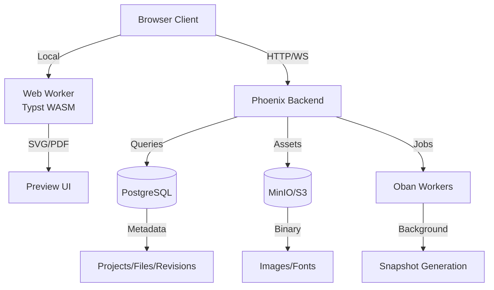

# Typst Live Editor — MVP

Implementation Plan

## Architecture Overview

The application will be built in phases, starting with a single-user MVP and expanding to collaborative editing. The architecture separates concerns between storage (PostgreSQL + MinIO), real-time sync (Phoenix Channels), and rendering (client-side Typst WASM).




## Phase 1: MVP Foundation (Single-User)

### 1.1 Database Schema & Migrations

**Files to create:**

- `priv/repo/migrations/YYYYMMDDHHMMSS_create_projects.exs`
- `priv/repo/migrations/YYYYMMDDHHMMSS_create_files.exs`
- `priv/repo/migrations/YYYYMMDDHHMMSS_create_file_revisions.exs`
- `priv/repo/migrations/YYYYMMDDHHMMSS_create_assets.exs`

**Schema modules:**

- `lib/typster/projects/project.ex` - Project schema
- `lib/typster/projects/file.ex` - File tree schema
- `lib/typster/projects/file_revision.ex` - Version history
- `lib/typster/assets/asset.ex` - Asset metadata

**Key tables:**

- `projects`: id, name, inserted_at, updated_at
- `files`: id, project_id, path (text), content (text), parent_id (nullable), inserted_at, updated_at
- `file_revisions`: id, file_id, content (text), sequence (integer), inserted_at
- `assets`: id, project_id, object_key (text), content_type, size, filename, inserted_at

### 1.2 Backend Dependencies

**Add dependencies:**Elixir doesn't have a `mix deps.add` command. Dependencies will be added to `mix.exs` programmatically, then run:

```bash
mix deps.get
```

This will fetch the latest compatible versions. Dependencies to add:

- `oban` (latest version)
- `ex_aws` (latest version)
- `ex_aws_s3` (latest version)
- `hackney` (latest version, HTTP client for ex_aws)

**Configuration:**

- `config/config.exs`: Oban configuration
- `config/dev.exs` / `config/runtime.exs`: MinIO endpoint, access keys, bucket name

### 1.3 Context Modules

**Create context modules:**

- `lib/typster/projects.ex` - Project CRUD operations
- `lib/typster/files.ex` - File tree operations (create, update, delete, list)
- `lib/typster/revisions.ex` - Revision history management
- `lib/typster/assets.ex` - Asset upload/download operations

**Key functions:**

- `Projects.create_project/1`, `Projects.get_project/1`, `Projects.list_projects/0`
- `Files.create_file/2`, `Files.update_file_content/2`, `Files.get_file_tree/1`, `Files.delete_file/1`
- `Revisions.create_revision/2`, `Revisions.list_revisions/1`, `Revisions.restore_revision/1`
- `Assets.upload_asset/3`, `Assets.get_asset_url/1`, `Assets.delete_asset/1`

### 1.4 Phoenix Routes & LiveViews

**Router updates (`lib/typster_web/router.ex`):**

- Add project routes: `live "/projects", ProjectLive.Index`
- Add editor route: `live "/projects/:id/edit", EditorLive`
- Add API routes for file operations (if needed for non-LiveView clients)

**LiveView modules:**

- `lib/typster_web/live/project_live/index.ex` - Project list/dashboard
- `lib/typster_web/live/project_live/show.ex` - Project detail with file tree
- `lib/typster_web/live/editor_live/index.ex` - Main editor interface

**Editor LiveView structure:**

- Left sidebar: File tree (expandable)
- Center: CodeMirror editor
- Right: Preview pane (SVG/PDF)
- Top: Project name, save status indicator

### 1.5 Frontend Dependencies

**Add dependencies via terminal:**

```bash
cd assets
npm init -y
npm install codemirror@latest
npm install @codemirror/lang-markdown@latest
npm install @codemirror/view@latest
npm install @codemirror/state@latest
npm install @codemirror/commands@latest
npm install typst-ts@latest
cd ..
```

Or install all at once:

```bash
cd assets && npm init -y && npm install codemirror@latest @codemirror/lang-markdown@latest @codemirror/view@latest @codemirror/state@latest @codemirror/commands@latest typst-ts@latest && cd ..
```

This will create/update `assets/package.json` automatically with latest versions.**Webpack/esbuild configuration:**

- Configure to load WASM files
- Set up worker entry point for Typst compilation

### 1.6 Frontend Components

**Create JavaScript modules:**

- `assets/js/editor.js` - CodeMirror setup and editor initialization
- `assets/js/typst_worker.js` - Web Worker for Typst compilation
- `assets/js/preview.js` - Preview rendering (SVG/PDF display)
- `assets/js/file_tree.js` - File tree UI component

**Editor integration:**

- Initialize CodeMirror in EditorLive mount
- Set up debounced autosave (300-800ms idle)
- Send content changes to Phoenix via LiveView `handle_event`
- Receive render results from worker and update preview

### 1.7 Autosave & Revision System

**Autosave flow:**

1. User types in CodeMirror → local state updates
2. Debounce timer (300-800ms) starts
3. On idle, send `handle_event("autosave", %{"file_id" => id, "content" => content}, socket)`
4. Backend creates revision via `Revisions.create_revision/2`
5. Update UI with "Saved" indicator

**Revision creation:**

- Create revision on explicit save
- Create revision on debounced autosave (if content changed)
- Create periodic checkpoints (every 5 minutes via Oban)

**Oban jobs:**

- `lib/typster/jobs/periodic_snapshot.ex` - Create checkpoint revisions
- `lib/typster/jobs/asset_cleanup.ex` - Clean orphaned assets

### 1.8 Asset Management

**MinIO setup:**

- Configure bucket for assets
- Set up CORS for direct client uploads (optional)
- Create presigned URL generation for asset access

**Asset upload flow:**

1. User selects file in editor
2. Client uploads to MinIO (or via backend proxy)
3. Backend records asset metadata in `assets` table
4. Return asset URL to client
5. Client inserts asset reference in Typst document

**Asset context:**

- `Assets.generate_upload_url/2` - Presigned URL for upload
- `Assets.get_asset_url/1` - Public/private URL for asset access

### 1.9 Real-Time Preview Updates

**Client-side rendering pipeline:**

1. CodeMirror onChange → debounce → send to worker
2. Worker compiles Typst → returns SVG/PDF + diagnostics
3. Update preview pane with new render
4. Display errors/warnings in editor (squiggles or gutter)

**Worker communication:**

- Use `postMessage` API between main thread and worker
- Worker loads Typst WASM module
- Compile document → render to SVG
- Return result to main thread

## Phase 2: History & Version Management

### 2.1 Revision UI

**Add to EditorLive:**

- Version history sidebar (toggleable)
- List revisions with timestamps
- "Restore version" action
- Diff view (optional, compare two revisions)

**Revision operations:**

- `Revisions.get_revision/1` - Fetch specific revision
- `Revisions.compare_revisions/2` - Generate diff (optional)
- `Revisions.restore_revision/1` - Create new revision from old content

### 2.2 Snapshot Optimization

**Oban job enhancements:**

- Periodic snapshot generation (every N revisions or minutes)
- Snapshot compaction (merge old revisions into snapshots)
- Retention policies (keep last N revisions, archive older)

## Phase 3: Collaboration (Future)

### 3.1 Yjs Integration

**Dependencies (add via terminal):**Backend:

```bash
mix deps.add y_ex
mix deps.get
```

Frontend:

```bash
cd assets
npm install yjs@latest y-phoenix@latest
cd ..
```

**Schema additions:**

- `y_updates` table: document_id, sequence, update_blob, actor, inserted_at
- `y_snapshots` table: document_id, snapshot_blob, base_sequence, inserted_at

**Channel setup:**

- `lib/typster_web/channels/document_channel.ex` - Yjs sync channel
- Use `y-phoenix` provider on client
- Broadcast updates to all connected clients

### 3.2 Presence

**Phoenix Presence:**

- Track active users in project
- Show "who's editing" indicators
- Cursor positions (optional, more complex)

## Implementation Order

1. **Database schema** (projects, files, revisions, assets)
2. **Backend contexts** (CRUD operations)
3. **MinIO setup** (bucket, configuration, upload/download)
4. **Basic LiveView** (project list, editor shell)
5. **Frontend editor** (CodeMirror integration)
6. **Typst worker** (WASM compilation, preview rendering)
7. **Autosave** (debounced saves, revision creation)
8. **File tree** (multi-file project support)
9. **Asset upload** (MinIO integration, asset references)
10. **History UI** (revision list, restore)
11. **Oban jobs** (periodic snapshots, cleanup)

## Key Files to Create/Modify

**Backend:**

- `lib/typster/projects/` - Schema modules
- `lib/typster/projects.ex` - Context
- `lib/typster/files.ex` - Context
- `lib/typster/revisions.ex` - Context
- `lib/typster/assets.ex` - Context
- `lib/typster/jobs/` - Oban workers
- `lib/typster_web/live/editor_live/` - Editor LiveView
- `lib/typster_web/live/project_live/` - Project management LiveViews
- Migrations in `priv/repo/migrations/`

**Frontend:**

- `assets/js/editor.js` - CodeMirror setup
- `assets/js/typst_worker.js` - Typst compilation worker
- `assets/js/preview.js` - Preview rendering
- `assets/js/file_tree.js` - File tree component
- `assets/js/app.js` - Integration with LiveView

**Configuration:**

- `config/config.exs` - Oban config
- `config/dev.exs` / `config/runtime.exs` - MinIO config

**Note:**

- Frontend dependencies: Use `npm install` commands in terminal (will auto-update `package.json`)